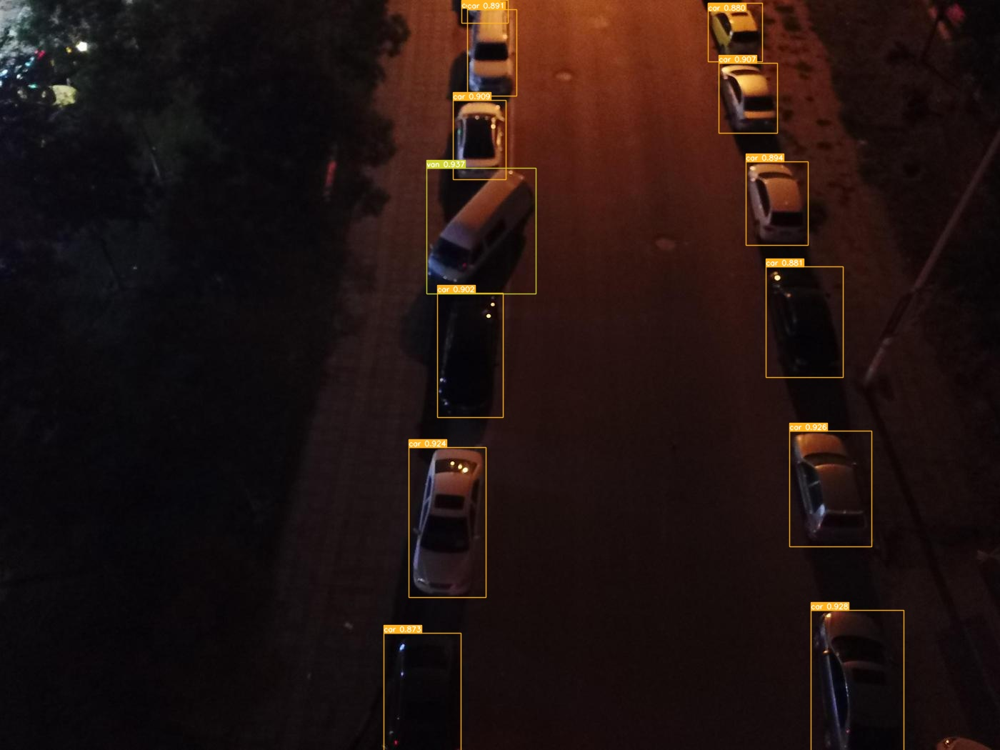
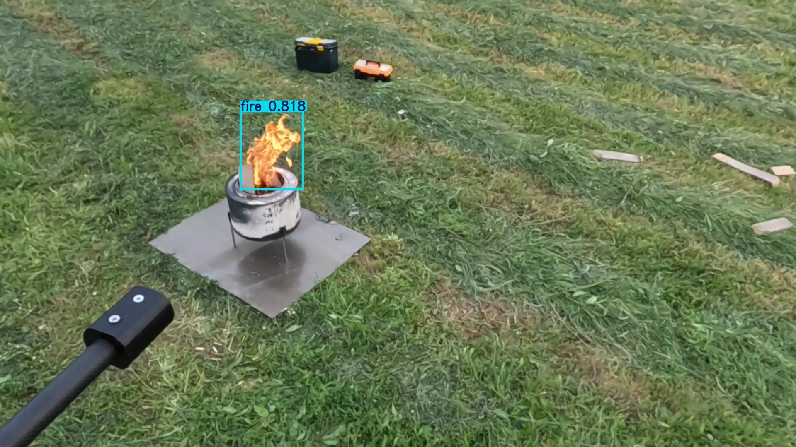
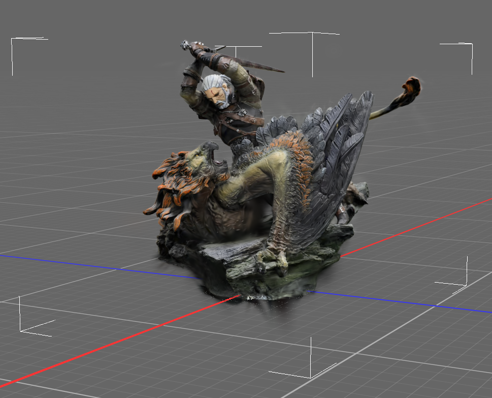
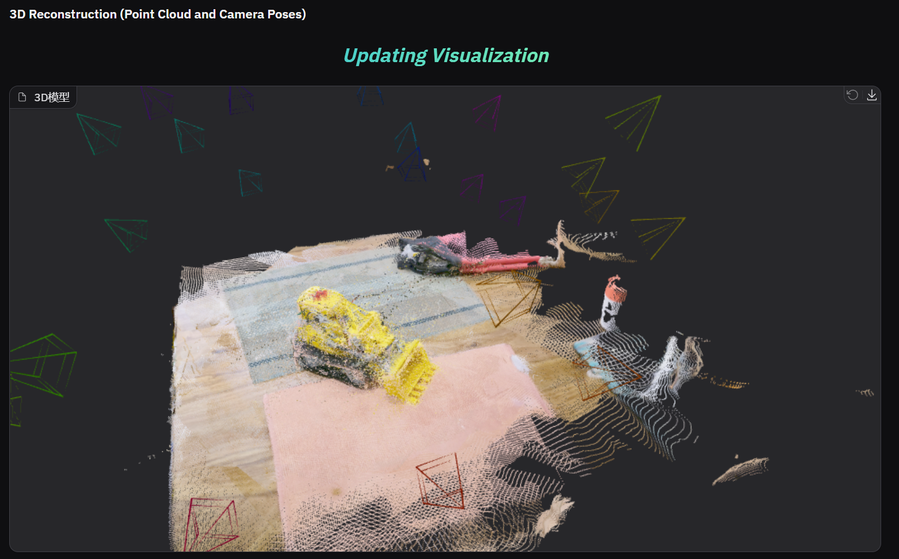

<!-- 头部：动态打字机效果 -->

  

  

<!-- 社交徽章 & 访问量 -->

  
  

---

### 👨‍💻 About Me

   
  <b>Learning:</b> Python, AI Engineering, Latex  
  
   
  <b>Focusing:</b> CV, PR, AI, RS  
    
  🎮 <b>Hobby:</b> 🕹️Game, 📷 Photograph, 🎹 Music, ⚽ Soccer  
  
  📮 <b>Contact:</b> Wentian_Shen@whu.edu.cn

---

### 🛠️ Tech Stack

  

---

### 🚀 Recent Works

  <table width="100%">
    <!-- ==============================================================
         项目 1: Object Detect
    =================================================================== -->
    <tr>
      <td colspan="2" align="center">
        <h3>🤖 Object Detect</h3>
        
基于 YOLO 系列的目标检测与识别

      </td>
    </tr>
    <tr>
      <!-- 左边的图：Car -->
      <td width="50%" align="center" valign="top">
        
      </td>
      <!-- 右边的图：Fire -->
      <td width="50%" align="center" valign="top">
        
      </td>
    </tr>
    <tr>
      <!-- GIF 演示 -->
      <td colspan="2" align="center">
         
        
      </td>
    </tr>
    <!-- 描述文字 -->
    <tr>
        <td colspan="2" align="left">
            <ul>
                <li>Detection of fire or car</li>
                <li>PyTorch, YOLOv5</li>
                <li><a href="https://github.com/wawjswt/Yolov5-Drone">Yolov5 &raquo;</a></li>
            </ul>
        </td>
    </tr>
    <!-- ==============================================================
         项目 2: Gaussian Splatting
    =================================================================== -->
    <tr>
      <td colspan="2" align="center">
         
        <h3>✨ Gaussian Splatting</h3>
        
3D 场景重建与渲染

      </td>
    </tr>
    <tr>
      <!-- 左边的图：Dog -->
      <td width="50%" align="center" valign="top">
        
      </td>
      <!-- 右边的图：Witcher -->
      <td width="50%" align="center" valign="top">
        
      </td>
    </tr>
    <!-- GIF 演示 -->
    <tr>
      <td colspan="2" align="center">
         
        
<strong>✨ Live Demo ✨</strong>

        
      </td>
    </tr>
    <!-- 描述文字 -->
    <tr>
        <td colspan="2" align="left">
            <ul>
                <li>重建效果展示，包括静态渲染与动态视角变化。</li>
                <li><a href="https://github.com/graphdeco-inria/gaussian-splatting">参考项目：Gaussian Splatting &raquo;</a></li>
            </ul>
        </td>
    </tr>
    <!-- ==============================================================
         项目 3: VGGT
    =================================================================== -->
    <tr>
      <td colspan="2" align="center">
         
        <h3>🎮 VGGT Project</h3>
        
视觉生成与游戏技术探索

        
          
        <!-- 修正：使用 div 代替 p 标签来包裹 ul，并修复了 ul 闭合标签 -->
        

          <ul>
           <li>这里是 VGGT 项目的简短介绍。探索了生成式 AI 在游戏场景中的应用。</li>
           <li><a href="https://github.com/facebookresearch/vggt">VGGT &raquo;</a></li>
          </ul>
        

      </td>
    </tr>
  </table>

---

### 📊 GitHub Stats

  

---

### 🐍 Contribution Snake

  

---

### 🏆 Trophies

  

---

### 🤣 Random Joke

  

  

