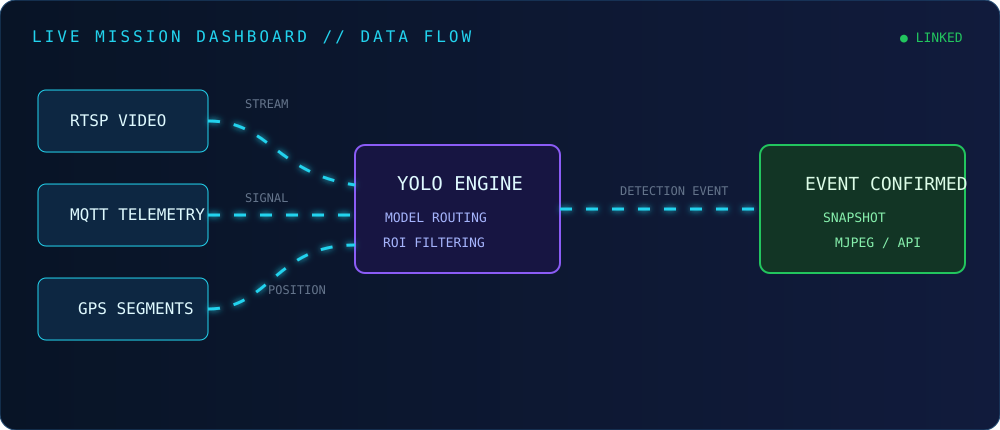
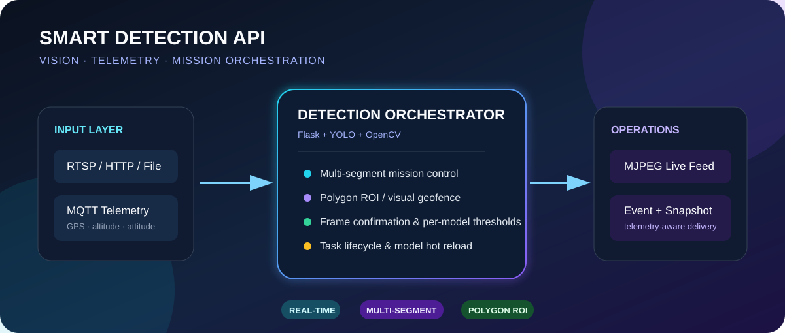
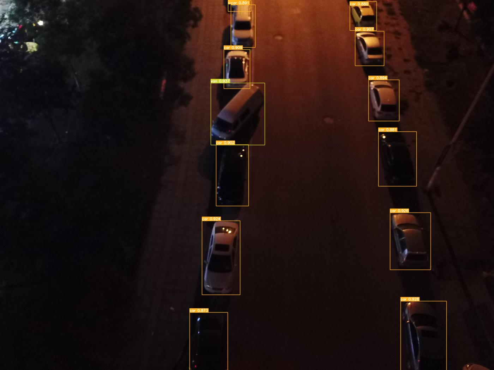
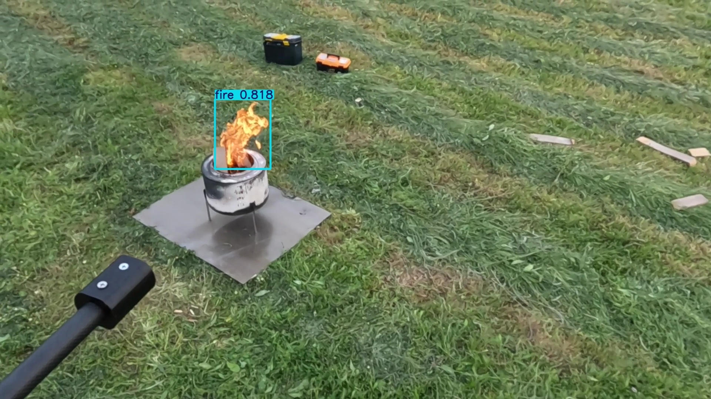
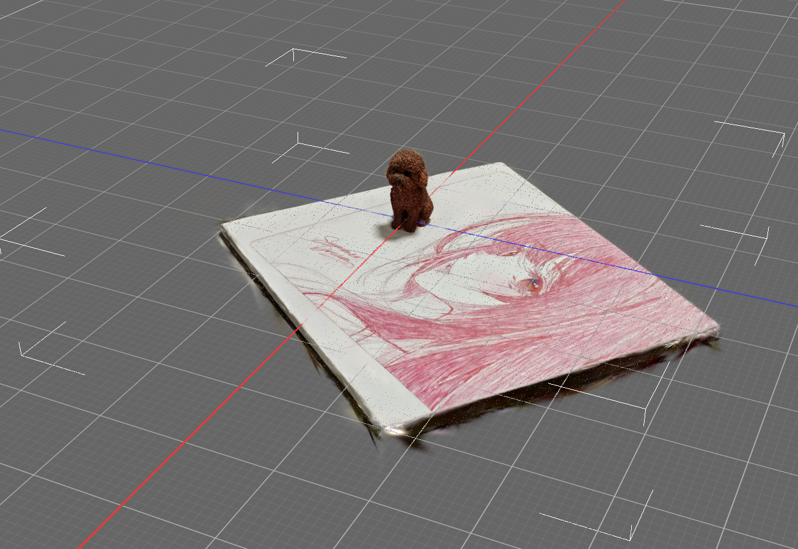
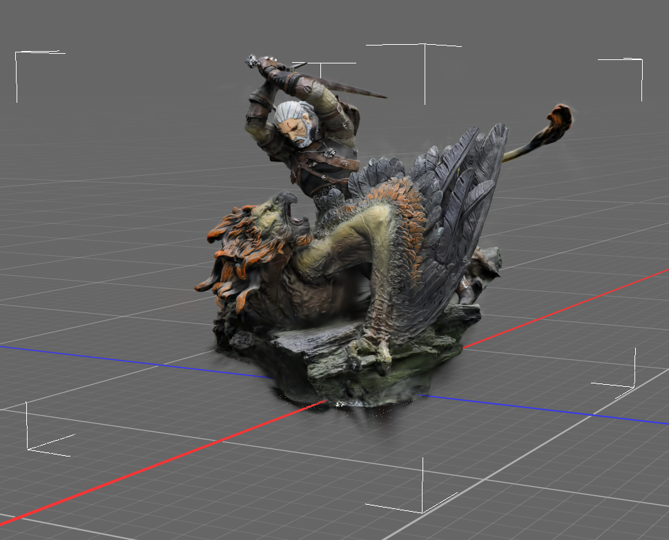
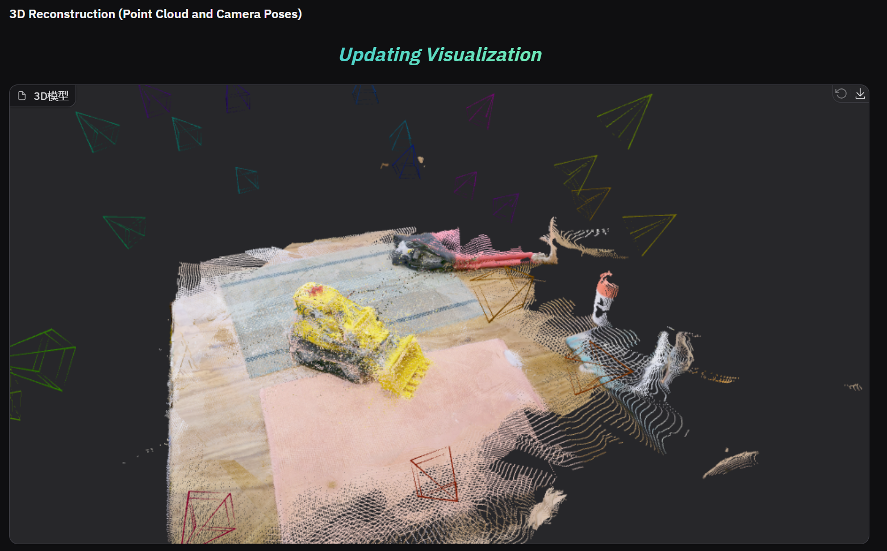
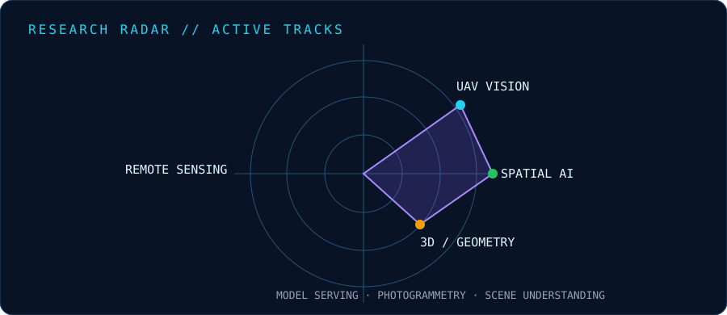
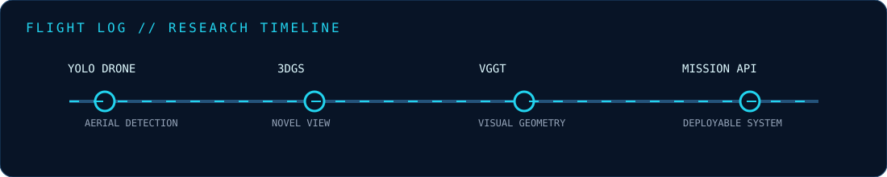

<!-- PROFILE README · Aerial Mission Control -->

<div align="center">
  
</div>

<div align="center">
  
</div>

<div align="center">
  <a href="https://github.com/wawjswt"></a>
  <a href="mailto:Wentian_Shen@whu.edu.cn"></a>
  
</div>

<div align="center">
  <a href="#now--smart-detection-api">NOW</a> ·
  <a href="#-mission-archives">MISSION ARCHIVES</a> ·
  <a href="#-research-radar">RESEARCH RADAR</a> ·
  <a href="#-github-telemetry">GITHUB TELEMETRY</a>
</div>

---

## 🛸 Identity Cockpit

> **将视觉智能转化为可落地的现场系统。**
> I build the path from computer-vision models to observable, controllable and deployable UAV workflows.

| Signal | Current Readout | Signal | Current Readout |
| :-- | :-- | :-- | :-- |
| 🎓 BASE | WHU · Wuhan, China | 🟢 MODE | Building in public |
| 🛰️ DOMAIN | UAV inspection | 🧠 TRACK | Computer vision + spatial AI |
| ⚙️ BUILD | Model → mission system | 🔭 NEXT | 3D reconstruction + VGGT |

- **Current focus:** drone inspection, real-time detection, telemetry fusion and spatial understanding.
- **What I build:** systems connecting model inference, video streams, GPS, MQTT and task orchestration.
- **Beyond code:** photography, games, music and football.
- **Contact:** [Wentian_Shen@whu.edu.cn](mailto:Wentian_Shen@whu.edu.cn)

## NOW // Smart Detection API

<div align="center">
  
</div>

> **Current build:** a local Flask prototype turning aerial video and drone context into a controllable inspection mission.
> 当前重点不是“跑一次检测”，而是把检测变成可追踪、可确认、可交付的任务闭环。

| Current signal | Readout | Current signal | Readout |
| :-- | :-- | :-- | :-- |
| 🟢 RUNTIME | Flask + Waitress | 🛰️ INPUT | RTSP · HTTP · local file |
| 🧠 INFERENCE | Multi-model YOLOv5 | 📡 CONTEXT | MQTT GPS · altitude · attitude |
| 🗺️ CONTROL | GPS segments + Polygon ROI | ✅ RELIABILITY | 4-frame confirmation |
| 📤 DELIVERY | MJPEG · snapshots · event push | 🔧 OPERATIONS | stop · hot reload · bounded queue |

<details>
<summary><b>Open the current mission loop</b></summary>

```text
POST /detect
  → attach a video source, drone identity, target classes and optional mission segments
  → wait for GPS arrival at a segment start point
  → route detections through model-specific confidence policies
  → keep detections whose centers fall inside the active Polygon ROI
  → require four consecutive detection frames before creating an event
  → stream annotated frames, save a snapshot and optionally push business metadata
  → stop at the segment endpoint, switch flight legs or accept a stop command
```

The service also caches DJI telemetry from MQTT, exposes the latest location on demand, and supports model reload without rebuilding the whole application.
</details>

<details>
<summary><b>Explore the public route surface</b></summary>

```http
POST /detect                           # create a detection task
GET  /video_feed/<task_id>             # MJPEG result stream
GET  /api/telemetry?sn=<drone_sn>      # latest MQTT telemetry
GET  /get_latest_snapshot?task_id=<id> # latest confirmed snapshot
POST /stop_detect                      # stop task and release stream resources
POST /reload_models                    # hot reload configured models
```

The public showcase intentionally describes the architecture only. Connection credentials, internal service addresses and deployment-specific configuration stay outside this profile README.
</details>

<details>
<summary><b>Sanitized task request</b></summary>

```json
{
  "rtsp_url": "rtsp://camera-or-drone-stream/live",
  "drone_sn": "DRONE-SN-PLACEHOLDER",
  "detect_classes": [0, 1, 3, 4],
  "conf_thres_drone": 0.52,
  "conf_thres_ent": 0.75,
  "segments": [
    {
      "start": [START_LAT, START_LON],
      "stop": [STOP_LAT, STOP_LON],
      "roi": [0.08, 0.18, 0.92, 0.18, 0.96, 0.88, 0.12, 0.88]
    }
  ]
}
```
</details>

## 🟢 Live Mission Dashboard

<div align="center">
  
</div>

| System | Status | Operational role |
| :-- | :--: | :-- |
| Video inference | 🟢 ONLINE | RTSP / HTTP / local stream processing |
| UAV telemetry | 🟢 LINKED | MQTT GPS, attitude and altitude context |
| Spatial control | 🟣 ACTIVE | GPS segments and polygon ROI |
| Event reliability | 🟡 VERIFYING | Consecutive-frame confirmation |
| Model deployment | 🟢 BUILDING | Serving, hot reload and field iteration |

## 🧭 Operational Toolkit

<div align="center">
  
</div>

| Vision & AI | Mission & Backend | Spatial Computing | Engineering |
| :-- | :-- | :-- | :-- |
| YOLOv5 · PyTorch · OpenCV | Flask · MQTT · RTSP · MJPEG | Remote Sensing · Photogrammetry · 3DGS | Docker · Git · Linux · C++ |

---

## 🚀 Mission Archives

### MISSION 01 // Smart Detection API

<div align="center">
  
  <br/><br/>
  
</div>

> **An engineering prototype for UAV inspection workflows.**
> 它将视频流、飞行轨迹、电子围栏、模型策略与实时反馈组织成可观测的任务闭环。

| Mission field | Readout |
| :-- | :-- |
| STATUS | 🟢 Active development |
| TYPE | UAV inspection / surveillance |
| CORE LOOP | Video → Inference → Telemetry → Decision |
| ROLE | Computer vision · backend · system orchestration |
| STACK | Flask · YOLOv5 / PyTorch · OpenCV · MQTT · Waitress |

#### Interface highlights

1. **Multi-segment mission:** each `segment` has independent start, stop and ROI rules; GPS position controls activation and switching.
2. **Two-layer spatial constraint:** GPS segments decide *when* to detect; polygon ROI decides *where* detections are trusted.
3. **Video + telemetry fusion:** RTSP / HTTP / local streams are linked with the latest MQTT GPS, attitude and altitude data.
4. **Policy-aware inference:** target categories can route to different YOLO models with independent confidence thresholds.
5. **Field operations:** consecutive-frame confirmation, MJPEG output, snapshots, stop control and model hot reload.

#### Mission flow

```text
Create task → enter GPS segment → activate inference → apply Polygon ROI
        → confirm across frames → save snapshot / deliver event
        → reach stop point → switch to next flight leg
```

#### API surface

```http
POST /detect                           # create detection task
GET  /video_feed/<task_id>             # MJPEG result stream
GET  /api/telemetry?sn=<drone_sn>      # latest MQTT telemetry
GET  /get_latest_snapshot?task_id=<id> # latest confirmed snapshot
POST /stop_detect                      # stop task
POST /reload_models                    # hot reload configured models
```

<details><summary><b>任务请求示例：双航段 + 双电子围栏</b></summary>

```json
{
  "rtsp_url": "rtsp://camera-or-drone-stream/live",
  "drone_sn": "DRONE-SN-001",
  "detect_classes": [0, 1, 3, 4],
  "conf_thres_drone": 0.52,
  "conf_thres_ent": 0.75,
  "segments": [
    {"start": {"lat": 30.53210, "lng": 114.36020}, "stop": {"lat": 30.53280, "lng": 114.36110}, "roi": [0.08, 0.18, 0.92, 0.18, 0.96, 0.88, 0.12, 0.88]},
    {"start": {"lat": 30.53300, "lng": 114.36130}, "stop": {"lat": 30.53370, "lng": 114.36210}, "roi": [0.18, 0.20, 0.82, 0.82]}
  ]
}
```
</details>

### MISSION 02 // YOLOv5 Drone

<div align="center">
  <a href="https://github.com/wawjswt/Yolov5-Drone"></a>
  <a href="https://github.com/wawjswt/Yolov5-Drone"></a><br/><br/>
  <a href="https://github.com/wawjswt/Yolov5-Drone"></a>
</div>

| Mission field | Readout |
| :-- | :-- |
| STATUS | 🟣 Exploration / research demo |
| OBJECTIVE | Aerial target detection for vehicles, fire and monitoring scenes |
| STACK | PyTorch · YOLOv5 · OpenCV |
| SOURCE | [Open repository →](https://github.com/wawjswt/Yolov5-Drone) |

### MISSION 03 // Gaussian Splatting

<div align="center"><br/><br/></div>

| Mission field | Readout |
| :-- | :-- |
| STATUS | 🟡 Spatial research |
| OBJECTIVE | 3D reconstruction, novel-view synthesis and visual expression |
| REFERENCE | [Gaussian Splatting →](https://github.com/graphdeco-inria/gaussian-splatting) |

### MISSION 04 // VGGT

<div align="center"></div>

| Mission field | Readout |
| :-- | :-- |
| STATUS | 🟣 Learning radar |
| OBJECTIVE | Visual geometry, scene understanding and interactive spatial expression |
| REFERENCE | [Explore VGGT →](https://github.com/facebookresearch/vggt) |

## 🔭 Research Radar

<div align="center"></div>

- **Aerial AI:** route-aware detection, UAV inspection and video-stream intelligence.
- **Spatial Computing:** visual geometry, 3D reconstruction, novel-view synthesis and scene understanding.
- **Remote Sensing:** photogrammetry, geospatial perception and image interpretation.
- **AI Engineering:** model serving, streaming, observability and controllable orchestration.

## 🗺️ Flight Log

<div align="center"></div>

> I am interested in the boundary where a vision algorithm becomes a dependable system for a real mission.

## 📡 GitHub Telemetry

<div align="center">
  
  
  <br/><br/>
  
  <br/><br/>
  
</div>

## 🐍 Contribution Flight Path

<div align="center"></div>

---

<div align="center">
  <h3>OPEN FREQUENCY</h3>
  <p>Open to exchanging ideas about computer vision, UAV inspection, remote sensing and practical AI systems.</p>
  <a href="mailto:Wentian_Shen@whu.edu.cn">📮 Contact mission control</a>
  <br/><br/>
  
</div>
