<!-- PROFILE README · Aerial Mission Control -->

<div align="center">
  
</div>

<div align="center">
  
</div>

<div align="center">
  <a href="https://github.com/wawjswt"></a>
  <a href="mailto:Wentian_Shen@whu.edu.cn"></a>
  
</div>

<div align="center">
  <a href="#now--smart-detection-api">NOW</a> ·
  <a href="#-recent-work">RECENT WORK</a> ·
  <a href="#-mission-archives">MISSION ARCHIVES</a> ·
  <a href="#-research-radar">RESEARCH RADAR</a> ·
  <a href="#-github-telemetry">GITHUB TELEMETRY</a>
</div>

---

## 🛸 About

> **将视觉智能转化为可落地的现场系统。**

I'm Wentian Shen at Wuhan University. I connect computer vision, drone inspection and spatial computing to build systems that can be used in the field.

| 🎓 Based at | 🛰️ Building | 🔭 Exploring |
| :-- | :-- | :-- |
| WHU · Wuhan, China | UAV vision and mission systems | Remote sensing · 3D scenes · visual geometry |

Outside the lab: photography, games, music and football.

## NOW // Smart Detection API

<div align="center">
  
</div>

> **Current build:** a local Flask prototype turning aerial video and drone context into a controllable inspection mission.
> 当前重点不是“跑一次检测”，而是把检测变成可追踪、可确认、可交付的任务闭环。

`Flask + Waitress` · `YOLOv5` · `RTSP / HTTP` · `DJI MQTT` · `GPS segments + Polygon ROI` · `MJPEG + event push`

<details>
<summary><b>Open the current mission loop</b></summary>

```text
POST /detect
  → attach a video source, drone identity, target classes and optional mission segments
  → keep the stream alive with bounded reconnect attempts and exponential backoff
  → wait for GPS arrival at a segment start point
  → route detections through model-specific confidence policies
  → keep detections whose centers fall inside the active Polygon ROI
  → require four consecutive detection frames before creating an event
  → stream annotated frames, save a snapshot and optionally push business metadata
  → stop at the segment endpoint, switch flight legs or accept a stop command
```

If a stream drops, the service retries within its configured budget; once that budget is exhausted, it marks the stream as failed, releases capture resources and ends the affected task cleanly. The service also caches DJI telemetry from MQTT, exposes the latest location on demand, and supports model reload without rebuilding the whole application.
</details>

<details>
<summary><b>Explore the public route surface</b></summary>

```http
POST /detect                           # create a detection task
GET  /video_feed/<task_id>             # MJPEG result stream
GET  /api/telemetry?sn=<drone_sn>      # latest MQTT telemetry
GET  /get_latest_snapshot?task_id=<id> # latest confirmed snapshot
POST /stop_detect                      # stop task and release stream resources
POST /reload_models                    # hot reload configured models
```

Connection details and deployment configuration are omitted from this public overview.
</details>

<details>
<summary><b>Request shape (placeholder values)</b></summary>

```text
POST /detect
  rtsp_url:       <RTSP / HTTP / local video source>
  drone_sn:       <drone identifier>
  detect_classes: <configured target classes>
  segments:
    - start:      <GPS waypoint>
      stop:       <GPS waypoint>
      roi:        <normalized polygon vertices>
```
</details>

<details>
<summary><b>Watch the mission dashboard</b></summary>

<div align="center">
  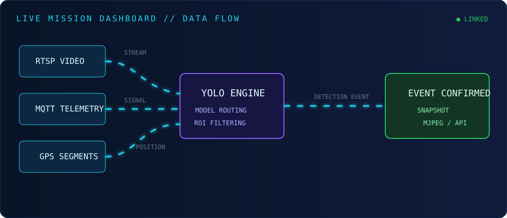
</div>

The dashboard visualizes stream input, telemetry context, spatial filtering and confirmed event delivery.
</details>

## 🛰️ Recent Work

> 最近在做的事情，是把“遥感影像看起来像什么”继续追问到“它能不能变成一个可分析、可对齐、可解释的 3D 场景”。

I am exploring how satellite images can guide navigable 3D scenes, and which parts of those scenes still rely on generation.

### RECENT // ABot-Earth Remote Sensing → 3D Scenes

Two contrasting scenes — water and agriculture, then a working port — reveal the same pattern: **large-scale layout is recognizable; height and hidden surfaces remain uncertain.**

<table>
  <tr>
    <td width="50%" valign="top">
      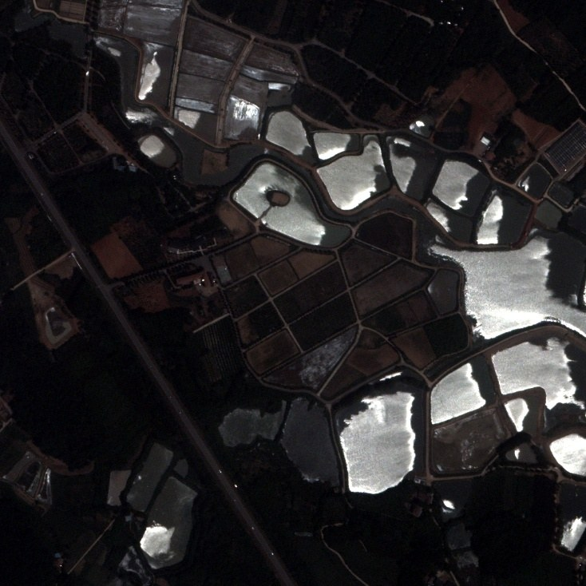
      <p align="center"><sub><b>INPUT / WATER–AGRICULTURE</b><br/>RGB scene · dense ponds and field parcels</sub></p>
    </td>
    <td width="50%" valign="top">
      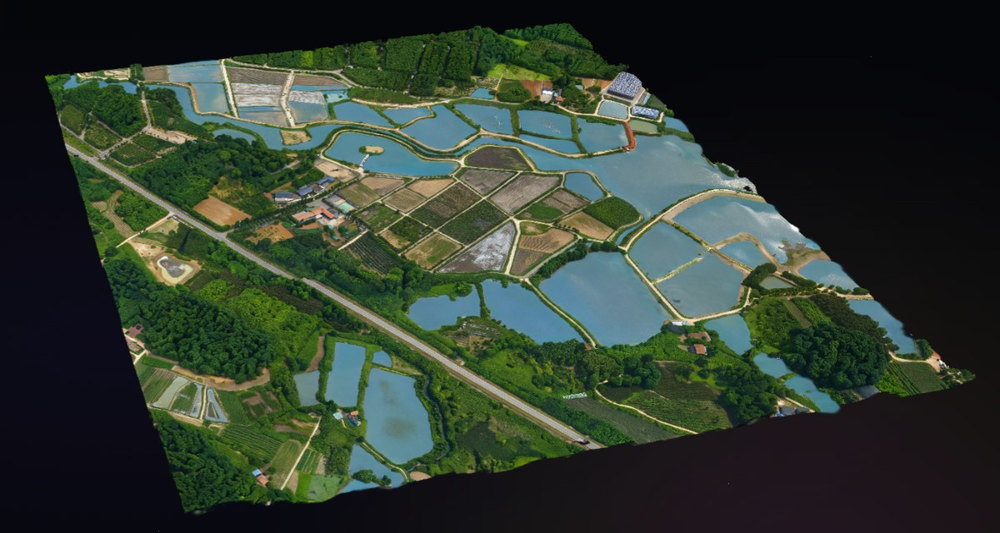
      <p align="center"><sub><b>OUTPUT / SCENE SYNTHESIS</b><br/>water semantics and the main road preserved; details regularized</sub></p>
    </td>
  </tr>
  <tr>
    <td width="50%" valign="top">
      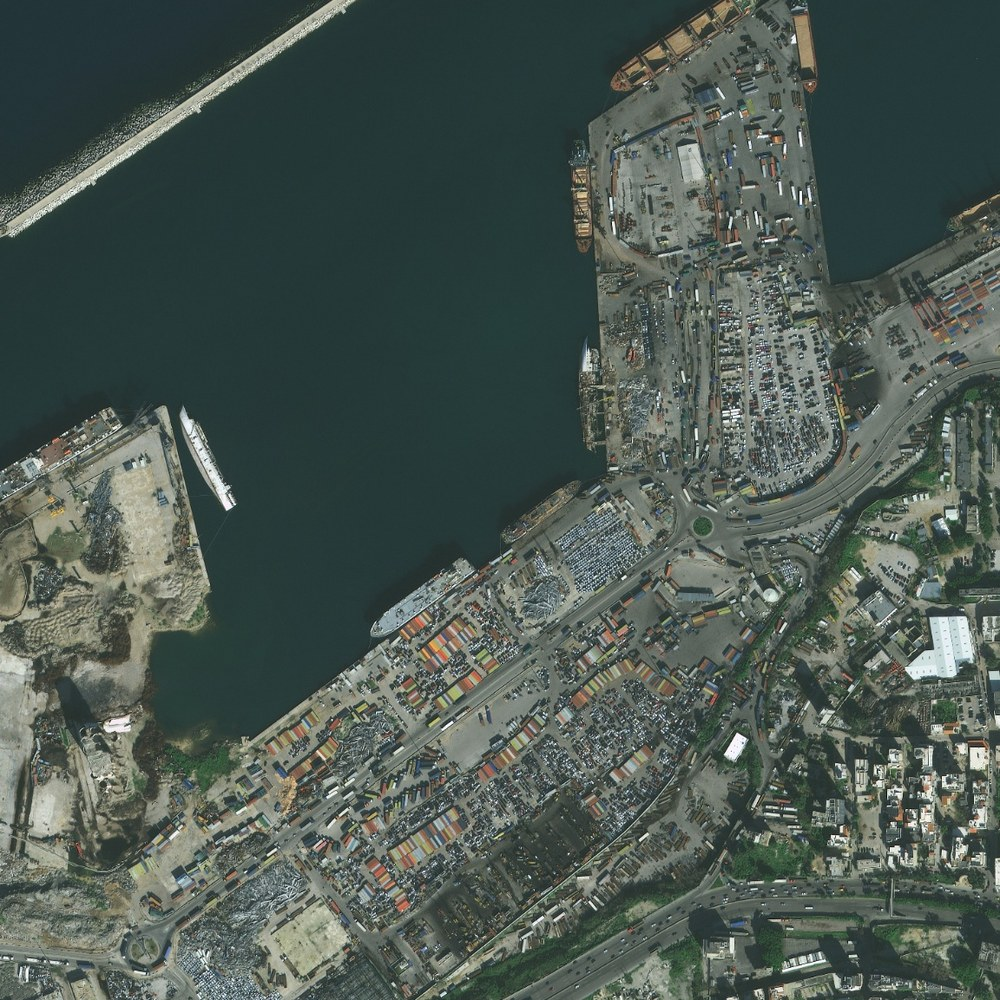
      <p align="center"><sub><b>INPUT / PORT LOGISTICS</b><br/>fine-resolution RGB scene · port, containers and roads</sub></p>
    </td>
    <td width="50%" valign="top">
      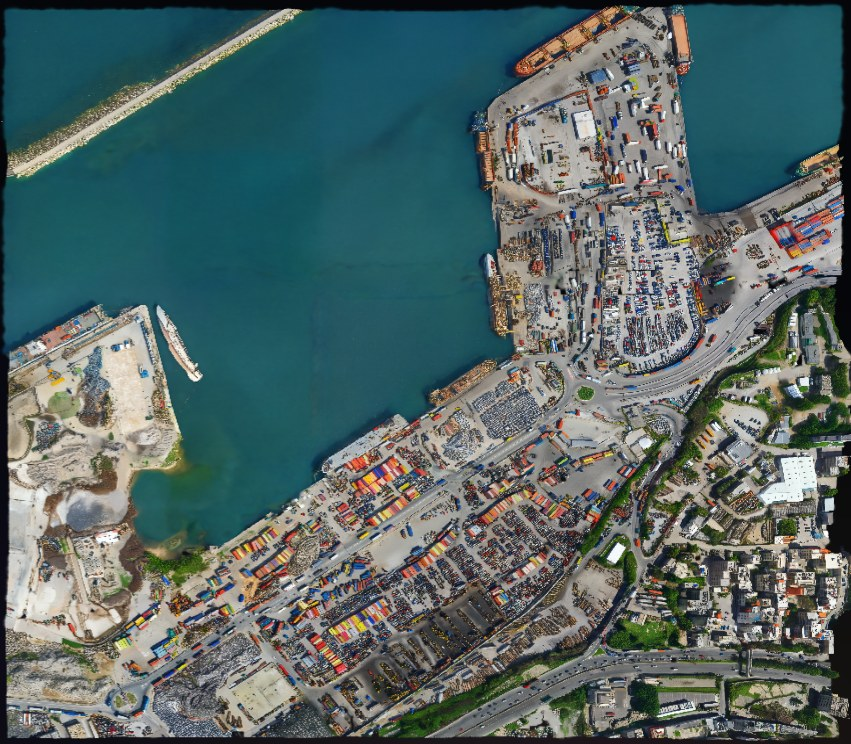
      <p align="center"><sub><b>OUTPUT / HIGH-RESOLUTION DETAIL</b><br/>richer small-target expression; oblique views expose height artifacts</sub></p>
    </td>
  </tr>
</table>

- **What held up:** water bodies, roads, field patterns and the port's main spatial layout.
- **What improved with finer imagery:** more visible vehicles, containers and other small objects.
- **What needs care:** building height, side surfaces and occluded areas are inferred; the scenes are for visual exploration rather than surveying.

<details>
<summary><b>Explore the experiment workflow</b></summary>

<div align="center">
  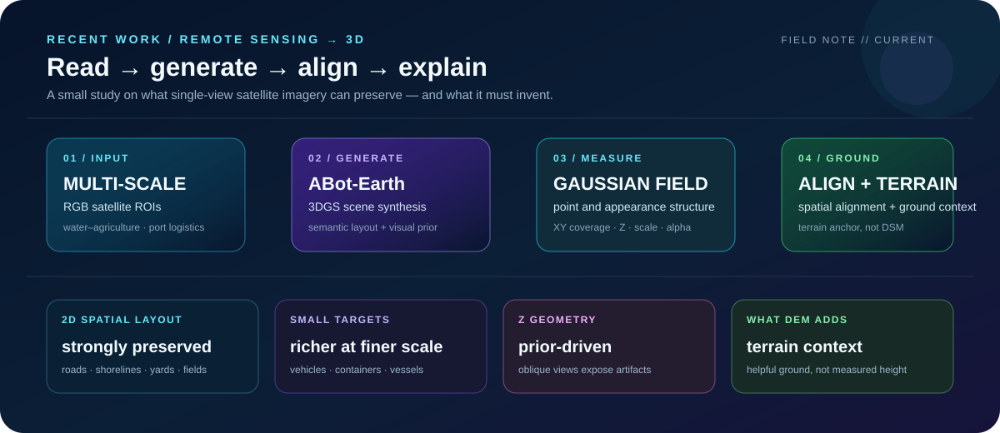
</div>

The Gaussian inspection showed broad XY correspondence between the generated scene and its input image. For terrain grounding, a georeferenced image was used as the horizontal anchor; a terrain raster was aligned to the image grid, invalid areas were masked, and two Z constructions were compared: **terrain drape** and **terrain + relative model Z**. The outputs are useful for visualization and scene interpretation, not for publishing exact coordinates or survey accuracy.

The practical boundary is clear: **terrain data supplies ground context, not a verified DSM**. The draped version helps place a generated scene on the landscape; the relative-height version helps explore visual relief, but its Z should not be read as measured building height.
</details>

---

## 🚀 Mission Archives

### MISSION 01 // Smart Detection API

> **An engineering prototype for UAV inspection workflows.**
> 它将视频流、飞行轨迹、电子围栏、模型策略与实时反馈组织成可观测的任务闭环。

- **Role:** Computer vision · backend · system orchestration
- **Stack:** Flask · YOLOv5 / PyTorch · OpenCV · MQTT · Waitress

<details>
<summary><b>Explore the architecture and engineering notes</b></summary>

<div align="center">
  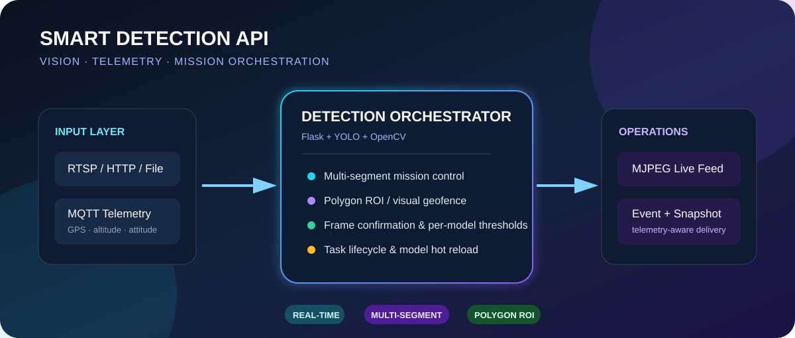
</div>

1. **Multi-segment mission:** each `segment` has independent start, stop and ROI rules; GPS position controls activation and switching.
2. **Two-layer spatial constraint:** GPS segments decide *when* to detect; polygon ROI decides *where* detections are trusted.
3. **Video + telemetry fusion:** RTSP / HTTP / local streams are linked with the latest MQTT GPS, attitude and altitude data.
4. **Policy-aware inference:** target categories can route to different YOLO models with independent confidence thresholds.
5. **Field operations:** consecutive-frame confirmation, MJPEG output, snapshots, stop control and model hot reload.
6. **Stream resilience:** failed video connections use bounded exponential-backoff retries; terminal failures release resources and close the affected task cleanly.
</details>

### MISSION 02 // YOLOv5 Drone

Vehicle and fire detection experiments from an aerial viewpoint. [Explore the project →](https://github.com/wawjswt/Yolov5-Drone)

<div align="center">
  <a href="https://github.com/wawjswt/Yolov5-Drone">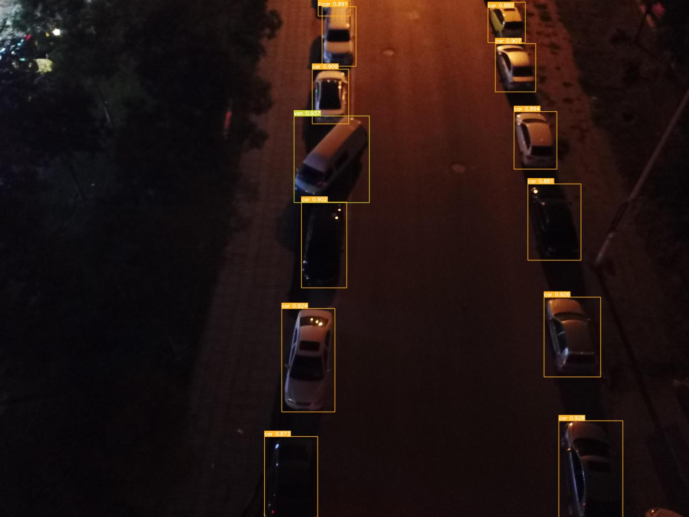</a>
  <a href="https://github.com/wawjswt/Yolov5-Drone">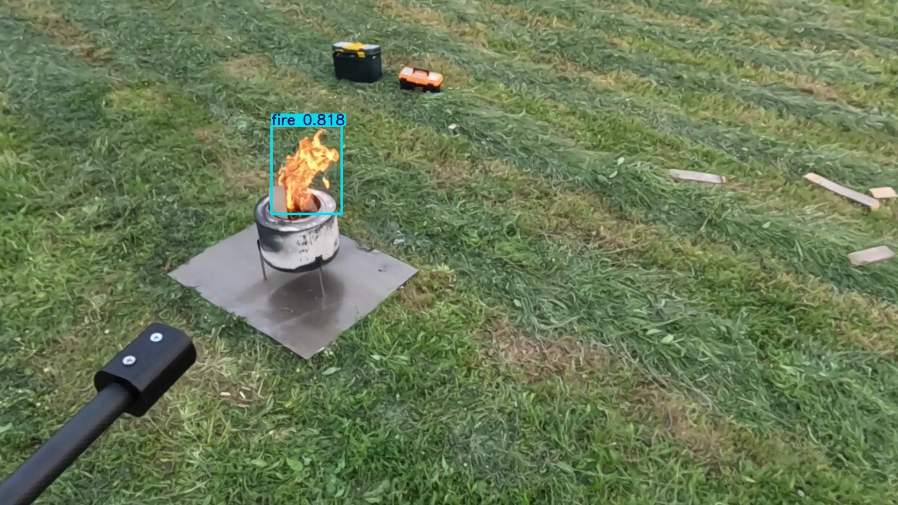</a>
</div>

<details>
<summary><b>Watch the aerial detection demo</b></summary>

<div align="center">
  
</div>
</details>

### MISSION 03 // Gaussian Splatting

Exploring scene reconstruction and novel-view synthesis with [Gaussian Splatting](https://github.com/graphdeco-inria/gaussian-splatting).

<div align="center">
  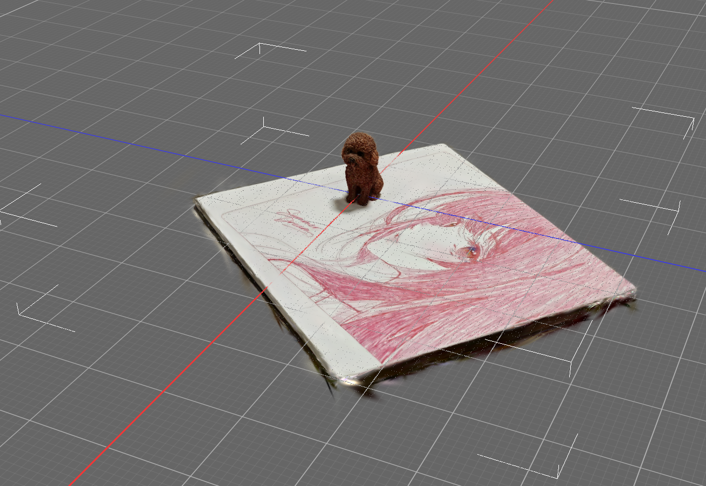
  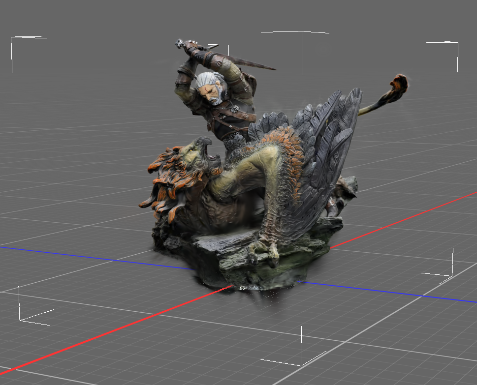
</div>

<details>
<summary><b>Watch the novel-view demo</b></summary>

<div align="center">
  
</div>
</details>

### MISSION 04 // VGGT

Learning visual geometry and scene understanding through [VGGT](https://github.com/facebookresearch/vggt).

<div align="center">
  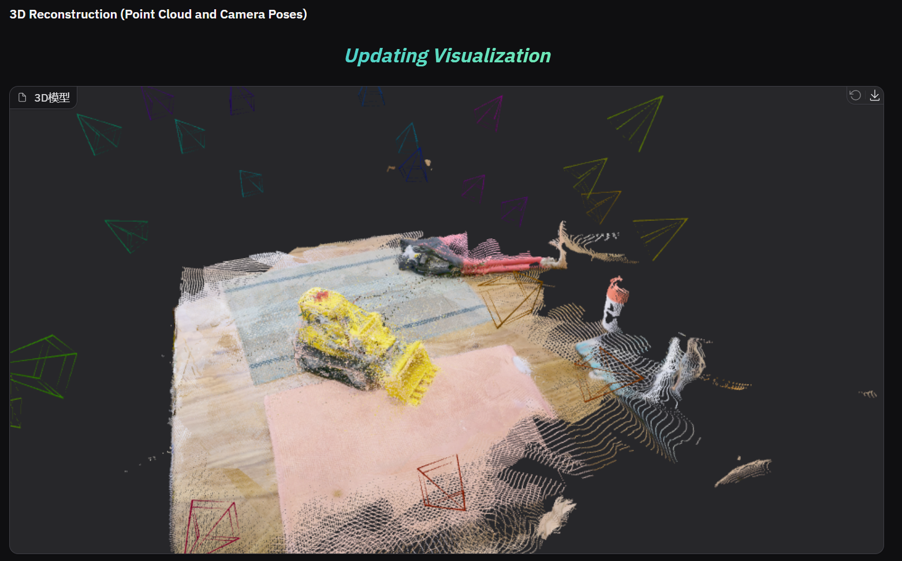
</div>

## 🧭 Operational Toolkit

<div align="center">
  
</div>

- **Vision & AI:** YOLOv5 · PyTorch · OpenCV
- **Mission systems:** Flask · MQTT · RTSP · MJPEG
- **Spatial computing:** Remote sensing · Photogrammetry · 3DGS

## 🔭 Research Radar

<div align="center">
  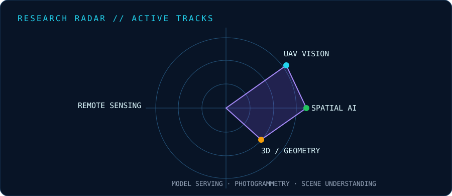
</div>

- **Aerial AI:** route-aware detection, UAV inspection and video-stream intelligence.
- **Spatial Computing:** visual geometry, 3D reconstruction, novel-view synthesis and scene understanding.
- **Remote Sensing:** photogrammetry, geospatial perception and image interpretation.
- **AI Engineering:** model serving, streaming, observability and controllable orchestration.

## 🗺️ Flight Log

> I am interested in the boundary where a vision algorithm becomes a dependable system for a real mission.

<details>
<summary><b>View the research timeline</b></summary>

<div align="center">
  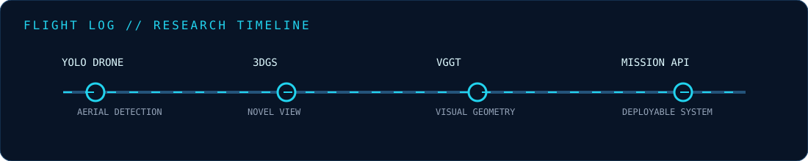
</div>
</details>

## 📡 GitHub Telemetry

<div align="center">
  
  
</div>

<details>
<summary><b>View activity and contribution streak</b></summary>

<div align="center">
  
  <br/><br/>
  
</div>
</details>

## 🐍 Contribution Flight Path

<div align="center"></div>

---

<div align="center">
  <h3>OPEN FREQUENCY</h3>
  <p>Open to exchanging ideas about computer vision, UAV inspection, remote sensing and practical AI systems.</p>
  <a href="mailto:Wentian_Shen@whu.edu.cn">📮 Contact mission control</a>
  <br/><br/>
  
</div>
